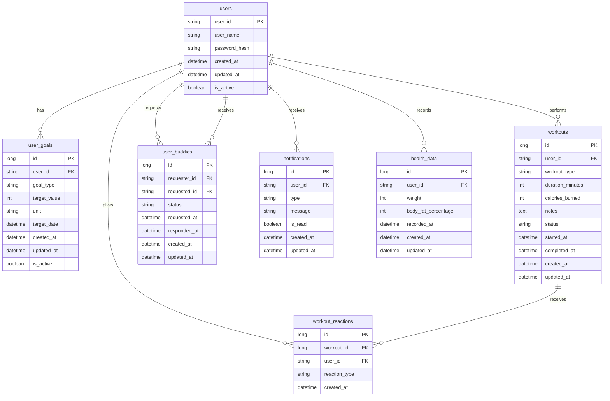
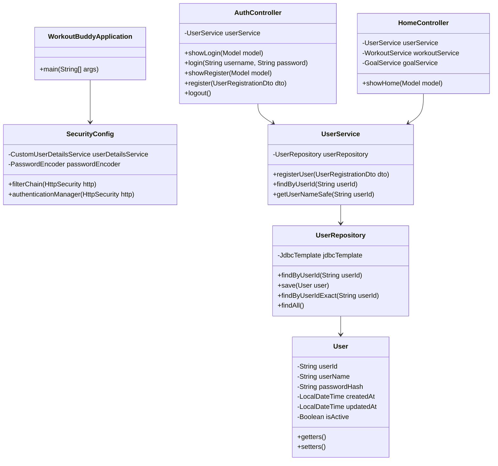

# Workout Buddy アプリケーション

## 📋 概要

Workout Buddyは、ユーザーが運動習慣を継続し、仲間と一緒に目標達成を目指すためのWebアプリケーションです。Spring BootとJdbcTemplateを使用したサーバーサイドレンダリング方式で構築されています。

## 🏗️ アーキテクチャ

### 技術スタック
- **フレームワーク**: Spring Boot 3.5.4
- **Java**: 21
- **データベース**: Microsoft SQL Server
- **データアクセス**: JdbcTemplate（JPA不使用）
- **テンプレートエンジン**: Thymeleaf
- **セキュリティ**: Spring Security
- **ビルドツール**: Maven
- **その他**: Lombok, Bean Validation

### アーキテクチャパターン
```
┌─────────────────┐    ┌─────────────────┐    ┌─────────────────┐
│   Controller    │───▶│     Service     │───▶│   Repository    │
│   (Thymeleaf)   │    │  (Business      │    │  (JdbcTemplate) │
│                 │    │   Logic)        │    │                 │
└─────────────────┘    └─────────────────┘    └─────────────────┘
         │                       │                       │
         ▼                       ▼                       ▼
┌─────────────────┐    ┌─────────────────┐    ┌─────────────────┐
│      View       │    │      DTO        │    │   Database      │
│   (HTML/CSS/JS) │    │   (Data Transfer│    │  (SQL Server)   │
│                 │    │    Objects)     │    │                 │
└─────────────────┘    └─────────────────┘    └─────────────────┘
```

## 🗄️ データベース設計

### ER図


### テーブル詳細

#### users（ユーザー）
| カラム名 | 型 | 説明 |
|---------|----|----|
| user_id | VARCHAR | ユーザーID（主キー） |
| user_name | VARCHAR | ユーザー名 |
| password_hash | VARCHAR | ハッシュ化されたパスワード |
| created_at | DATETIME | 作成日時 |
| updated_at | DATETIME | 更新日時 |
| is_active | BOOLEAN | アクティブフラグ |

#### user_goals（ユーザー目標）
| カラム名 | 型 | 説明 |
|---------|----|----|
| id | BIGINT | 主キー |
| user_id | VARCHAR | ユーザーID（外部キー） |
| goal_type | VARCHAR | 目標タイプ（例：weekly_workouts） |
| target_value | INT | 目標値 |
| unit | VARCHAR | 単位（例：回、分） |
| target_date | DATETIME | 目標達成日 |
| created_at | DATETIME | 作成日時 |
| updated_at | DATETIME | 更新日時 |
| is_active | BOOLEAN | アクティブフラグ |

#### workouts（運動記録）
| カラム名 | 型 | 説明 |
|---------|----|----|
| id | BIGINT | 主キー |
| user_id | VARCHAR | ユーザーID（外部キー） |
| workout_type | VARCHAR | 運動タイプ |
| duration_minutes | INT | 運動時間（分） |
| calories_burned | INT | 消費カロリー |
| notes | TEXT | メモ |
| status | VARCHAR | ステータス（in_progress, completed） |
| started_at | DATETIME | 開始時刻 |
| completed_at | DATETIME | 完了時刻 |
| created_at | DATETIME | 作成日時 |
| updated_at | DATETIME | 更新日時 |

#### user_buddies（バディ関係）
| カラム名 | 型 | 説明 |
|---------|----|----|
| id | BIGINT | 主キー |
| requester_id | VARCHAR | リクエスト送信者ID（外部キー） |
| requested_id | VARCHAR | リクエスト受信者ID（外部キー） |
| status | VARCHAR | ステータス（pending, accepted, rejected） |
| requested_at | DATETIME | リクエスト日時 |
| responded_at | DATETIME | レスポンス日時 |
| created_at | DATETIME | 作成日時 |
| updated_at | DATETIME | 更新日時 |

#### notifications（通知）
| カラム名 | 型 | 説明 |
|---------|----|----|
| id | BIGINT | 主キー |
| user_id | VARCHAR | ユーザーID（外部キー） |
| type | VARCHAR | 通知タイプ |
| message | VARCHAR | メッセージ |
| is_read | BOOLEAN | 既読フラグ |
| created_at | DATETIME | 作成日時 |
| updated_at | DATETIME | 更新日時 |

## 🏛️ クラス設計

### パッケージ構造
```
com.benesse.workoutbuddy/
├── WorkoutBuddyApplication.java          # メインアプリケーションクラス
├── config/                              # 設定クラス
│   ├── SecurityConfig.java              # Spring Security設定
│   └── PasswordEncoderConfig.java       # パスワードエンコーダー設定
├── controller/                          # コントローラー層
│   ├── AuthController.java              # 認証・登録
│   ├── HomeController.java              # ホーム画面
│   ├── GoalController.java              # 目標設定
│   ├── WorkoutController.java           # 運動管理
│   ├── BuddyController.java             # バディ管理
│   └── NotificationController.java      # 通知管理
├── service/                             # サービス層
│   ├── UserService.java                 # ユーザー管理
│   ├── GoalService.java                 # 目標管理
│   ├── WorkoutService.java              # 運動管理
│   ├── BuddyService.java                # バディ管理
│   ├── NotificationService.java         # 通知管理
│   └── CustomUserDetailsService.java    # Spring Security統合
├── repository/                          # リポジトリ層
│   ├── UserRepository.java              # ユーザーデータアクセス
│   ├── UserGoalRepository.java          # 目標データアクセス
│   ├── WorkoutRepository.java           # 運動データアクセス
│   ├── UserBuddyRepository.java         # バディデータアクセス
│   └── NotificationRepository.java      # 通知データアクセス
├── entity/                              # エンティティクラス
│   ├── User.java                        # ユーザーエンティティ
│   ├── UserGoal.java                    # 目標エンティティ
│   ├── Workout.java                     # 運動エンティティ
│   ├── UserBuddy.java                   # バディ関係エンティティ
│   ├── Notification.java                # 通知エンティティ
│   ├── WorkoutReaction.java             # 運動リアクションエンティティ
│   └── HealthData.java                  # 健康データエンティティ
├── dto/                                 # データ転送オブジェクト
│   ├── UserRegistrationDto.java         # ユーザー登録DTO
│   ├── GoalDto.java                     # 目標DTO
│   ├── ProgressDto.java                 # 進捗DTO
│   └── WorkoutDto.java                  # 運動DTO
└── util/                                # ユーティリティ
    └── SecurityUtil.java                # セキュリティユーティリティ
```

### クラス図（主要クラス）


## 🎯 主要機能

### 1. ユーザー認証・登録
- **ログイン機能**: ユーザーIDとパスワードによる認証
- **新規登録**: ユーザーID、ユーザー名、パスワードによる登録
- **パスワードハッシュ化**: BCryptによるセキュアなパスワード管理
- **セッション管理**: Spring Securityによるセッション制御

### 2. ホーム画面
- **今日の運動状況**: 現在進行中の運動表示
- **目標進捗**: 週間目標の達成状況
- **バディ状況**: バディの運動状況
- **通知表示**: 未読通知の件数表示

### 3. 目標設定
- **目標タイプ**: 週間運動回数、運動時間など
- **目標値設定**: 数値と単位による目標設定
- **目標日設定**: 達成目標日の設定
- **目標履歴**: 過去の目標設定履歴

### 4. 運動管理
- **運動開始**: 運動タイプと開始時刻の記録
- **運動進行中**: リアルタイムでの運動状況表示
- **運動完了**: 運動時間、消費カロリー、メモの記録
- **運動履歴**: 過去の運動記録一覧
- **リアクション機能**: バディへの運動完了通知

### 5. バディ機能
- **ユーザー検索**: ユーザーIDによる完全一致検索
- **バディリクエスト**: 他のユーザーへのバディ申請
- **リクエスト承認/拒否**: 受信したリクエストの処理
- **バディ一覧**: 承認済みバディの表示
- **バディ削除**: バディ関係の解除

### 6. 通知機能
- **通知一覧**: 受信した通知の表示
- **通知履歴**: 過去の通知履歴
- **既読管理**: 通知の既読/未読管理
- **通知タイプ**: バディリクエスト、運動完了など

## 🎨 UI/UX設計

### デザイン方針
- **スマートフォン最適化**: 固定幅（420px）のスマートフォン向けレイアウト
- **レスポンシブ対応**: PCでもスマートフォンサイズで表示
- **統一されたUI**: 全画面で統一されたヘッダーとボトムナビゲーション

### 画面構成
```
┌─────────────────────────────────────┐
│ ヘッダー（タイトル + 通知ベル）        │
├─────────────────────────────────────┤
│                                     │
│          メインコンテンツ            │
│                                     │
├─────────────────────────────────────┤
│ ボトムナビゲーション                 │
│ [ホーム][バディ][運動][記録][目標]    │
└─────────────────────────────────────┘
```

### 画面一覧
1. **ログイン画面** (`/login`)
2. **新規登録画面** (`/register`)
3. **ホーム画面** (`/`)
4. **目標設定画面** (`/goal/set`)
5. **バディ一覧画面** (`/buddy`)
6. **バディ検索画面** (`/buddy/search`)
7. **運動開始画面** (`/workout/start`)
8. **運動進行中画面** (`/workout/in-progress`)
9. **運動完了画面** (`/workout/complete`)
10. **運動記録画面** (`/workout/records`)
11. **通知一覧画面** (`/notifications`)
12. **通知履歴画面** (`/notifications/history`)

## 🔧 設定

### アプリケーション設定 (`application.properties`)
```properties
# データベース設定
spring.datasource.url=jdbc:sqlserver://localhost:1433;databaseName=WorkoutBuddyDB;encrypt=false
spring.datasource.username=${DB_USERNAME:sa}
spring.datasource.password=${DB_PASSWORD:password}
spring.datasource.driver-class-name=com.microsoft.sqlserver.jdbc.SQLServerDriver

# JdbcTemplate設定
spring.jdbc.template.query-timeout=30
spring.jdbc.template.max-rows=1000

# Thymeleaf設定
spring.thymeleaf.cache=false
spring.thymeleaf.prefix=classpath:/templates/
spring.thymeleaf.suffix=.html
spring.thymeleaf.encoding=UTF-8

# Spring Security設定
spring.security.user.name=admin
spring.security.user.password=admin

# サーバー設定
server.port=8080
server.servlet.context-path=/

# ログ設定
logging.level.root=INFO
logging.level.com.benesse.workoutbuddy=INFO
logging.pattern.console=%d{yyyy-MM-dd HH:mm:ss} - %msg%n
```

### セキュリティ設定
- **認証方式**: フォーム認証
- **パスワードエンコーダー**: BCrypt
- **セッション管理**: 最大1セッション
- **CSRF**: 開発時は無効化

## 🚀 セットアップ・実行

### 前提条件
- Java 21
- Maven 3.6+
- Microsoft SQL Server
- Node.js（オプション：フロントエンド開発用）

### 1. データベース準備
```sql
-- SQL Serverでデータベース作成
CREATE DATABASE WorkoutBuddyDB;
```

### 2. 環境変数設定
```bash
# Windows
set DB_USERNAME=sa
set DB_PASSWORD=password

# Linux/Mac
export DB_USERNAME=sa
export DB_PASSWORD=password
```

### 3. アプリケーション実行
```bash
# Mavenでビルド
mvn clean compile

# アプリケーション起動
mvn spring-boot:run

# または
java -jar target/workout-buddy-0.0.1-SNAPSHOT.jar
```

### 4. アクセス
- URL: http://localhost:8080
- 初期ユーザー: 新規登録から作成

## 📁 ファイル構造

```
workout-buddy/
├── pom.xml                              # Maven設定
├── README.md                            # このファイル
├── src/
│   ├── main/
│   │   ├── java/
│   │   │   └── com/benesse/workoutbuddy/
│   │   │       ├── config/              # 設定クラス
│   │   │       ├── controller/          # コントローラー
│   │   │       ├── service/             # サービス
│   │   │       ├── repository/          # リポジトリ
│   │   │       ├── entity/              # エンティティ
│   │   │       ├── dto/                 # DTO
│   │   │       ├── util/                # ユーティリティ
│   │   │       └── WorkoutBuddyApplication.java
│   │   └── resources/
│   │       ├── application.properties   # アプリケーション設定
│   │       ├── schema.sql               # データベーススキーマ
│   │       ├── static/                  # 静的リソース
│   │       │   ├── css/                 # スタイルシート
│   │       │   │   ├── common.css       # 共通スタイル
│   │       │   │   ├── auth.css         # 認証画面スタイル
│   │       │   │   ├── home.css         # ホーム画面スタイル
│   │       │   │   ├── buddy.css        # バディ画面スタイル
│   │       │   │   ├── workout.css      # 運動画面スタイル
│   │       │   │   ├── notification.css # 通知画面スタイル
│   │       │   │   └── goal.css         # 目標画面スタイル
│   │       │   ├── js/                  # JavaScript
│   │       │   │   ├── home.js          # ホーム画面スクリプト
│   │       │   │   ├── buddy.js         # バディ画面スクリプト
│   │       │   │   ├── workout.js       # 運動画面スクリプト
│   │       │   │   └── notification.js  # 通知画面スクリプト
│   │       │   └── images/              # 画像ファイル
│   │       └── templates/               # Thymeleafテンプレート
│   │           ├── auth/                # 認証画面
│   │           │   ├── login.html       # ログイン画面
│   │           │   └── register.html    # 新規登録画面
│   │           ├── buddy/               # バディ画面
│   │           │   ├── list.html        # バディ一覧
│   │           │   └── search.html      # バディ検索
│   │           ├── workout/             # 運動画面
│   │           │   ├── start.html       # 運動開始
│   │           │   ├── in-progress.html # 運動進行中
│   │           │   └── complete.html    # 運動完了
│   │           ├── goal/                # 目標画面
│   │           │   └── set.html         # 目標設定
│   │           ├── notifications/       # 通知画面
│   │           │   └── history.html     # 通知履歴
│   │           ├── home.html            # ホーム画面
│   │           └── notifications.html   # 通知一覧
│   └── test/                            # テストコード
└── target/                              # ビルド出力
```

## 🔍 デバッグ・ログ

### ログレベル
- **INFO**: 一般的な情報
- **DEBUG**: デバッグ情報（開発時のみ）

### 主要ログ出力箇所
- ユーザー認証・登録処理
- データベース操作
- バディ検索処理
- エラー発生時

### ログ形式
```
2024-01-01 12:00:00 - メッセージ内容
```

## 🧪 テスト

### 単体テスト
```bash
# テスト実行
mvn test

# 特定のテストクラス実行
mvn test -Dtest=UserServiceTest
```

### 統合テスト
```bash
# 統合テスト実行
mvn verify
```

## 📝 開発ガイドライン

### コーディング規約
- **命名規則**: キャメルケース（メソッド、変数）、パスカルケース（クラス）
- **パッケージ構造**: 機能別に分離
- **MVC分離**: ビジネスロジックはService層に配置
- **例外処理**: 適切な例外ハンドリング

### データベース設計原則
- **正規化**: 適切な正規化レベル
- **インデックス**: 検索頻度の高いカラムにインデックス
- **外部キー制約**: データ整合性の確保

### セキュリティ考慮事項
- **パスワードハッシュ化**: BCrypt使用
- **SQLインジェクション対策**: PreparedStatement使用
- **XSS対策**: Thymeleafの自動エスケープ
- **CSRF対策**: 本番環境では有効化

## 🚀 デプロイ

### 本番環境設定
```properties
# 本番環境用設定
spring.profiles.active=production
spring.datasource.url=jdbc:sqlserver://production-server:1433;databaseName=WorkoutBuddyDB
spring.thymeleaf.cache=true
logging.level.root=WARN
```

### Docker化
```dockerfile
FROM openjdk:21-jdk-slim
COPY target/workout-buddy-0.0.1-SNAPSHOT.jar app.jar
EXPOSE 8080
ENTRYPOINT ["java", "-jar", "/app.jar"]
```

## 🌿 ブランチ戦略

### ブランチ構成
```
main (本番環境)
├── develop (開発環境)
│   ├── feature/user-auth (sekiya担当)
│   ├── feature/workout-management (fujii担当)
│   ├── feature/buddy-system (takahashi担当)
│   ├── feature/goal-setting (doi担当)
│   └── feature/notification (nagahama担当)
├── hotfix/urgent-fix
└── release/v1.0.0
```

### ブランチ命名規則

#### メインブランチ
- `main`: 本番環境用ブランチ（直接コミット禁止）
- `develop`: 開発環境用ブランチ（統合テスト用）

#### 機能ブランチ
- `feature/機能名-担当者名`: 新機能開発用
- 例: `feature/user-auth-sekiya`, `feature/workout-management-fujii`

#### 修正ブランチ
- `hotfix/修正内容`: 緊急修正用
- `bugfix/修正内容`: バグ修正用

#### リリースブランチ
- `release/バージョン番号`: リリース準備用
- 例: `release/v1.0.0`

### 開発フロー

#### 1. 機能開発フロー
```bash
# 1. developブランチから機能ブランチを作成
git checkout develop
git pull origin develop
git checkout -b feature/機能名-担当者名

# 2. 開発作業
# ... コーディング ...

# 3. コミット（日本語で分かりやすく）
git add .
git commit -m "feat: ユーザー認証機能を追加 (sekiya)"

# 4. developブランチにマージ
git checkout develop
git pull origin develop
git merge feature/機能名-担当者名
git push origin develop

# 5. 機能ブランチを削除
git branch -d feature/機能名-担当者名
```

#### 2. リリースフロー
```bash
# 1. リリースブランチを作成
git checkout develop
git checkout -b release/v1.0.0

# 2. リリース準備（バージョン番号更新など）
# ... リリース準備作業 ...

# 3. mainブランチにマージ
git checkout main
git merge release/v1.0.0
git tag v1.0.0
git push origin main --tags

# 4. developブランチにもマージ
git checkout develop
git merge release/v1.0.0
git push origin develop

# 5. リリースブランチを削除
git branch -d release/v1.0.0
```

#### 3. ホットフィックスフロー
```bash
# 1. mainブランチからホットフィックスブランチを作成
git checkout main
git checkout -b hotfix/urgent-fix

# 2. 緊急修正
# ... 修正作業 ...

# 3. mainブランチにマージ
git checkout main
git merge hotfix/urgent-fix
git tag v1.0.1
git push origin main --tags

# 4. developブランチにもマージ
git checkout develop
git merge hotfix/urgent-fix
git push origin develop

# 5. ホットフィックスブランチを削除
git branch -d hotfix/urgent-fix
```

### 担当者別開発領域

#### sekiya (ユーザー認証・セキュリティ)
- **担当機能**: ユーザー認証、セキュリティ設定、パスワード管理
- **関連ファイル**: 
  - `AuthController.java`
  - `SecurityConfig.java`
  - `UserService.java`
  - `auth/` テンプレート
  - `auth.css`

#### fujii (運動管理機能)
- **担当機能**: 運動記録、運動進行管理、運動履歴
- **関連ファイル**:
  - `WorkoutController.java`
  - `WorkoutService.java`
  - `WorkoutRepository.java`
  - `workout/` テンプレート
  - `workout.css`, `workout.js`

#### takahashi (バディシステム)
- **担当機能**: バディ検索、バディリクエスト、バディ管理
- **関連ファイル**:
  - `BuddyController.java`
  - `BuddyService.java`
  - `UserBuddyRepository.java`
  - `buddy/` テンプレート
  - `buddy.css`, `buddy.js`

#### doi (目標設定機能)
- **担当機能**: 目標設定、進捗管理、目標履歴
- **関連ファイル**:
  - `GoalController.java`
  - `GoalService.java`
  - `UserGoalRepository.java`
  - `goal/` テンプレート
  - `goal.css`

#### nagahama (通知システム)
- **担当機能**: 通知管理、通知履歴、リアクション機能
- **関連ファイル**:
  - `NotificationController.java`
  - `NotificationService.java`
  - `NotificationRepository.java`
  - `notifications/` テンプレート
  - `notification.css`, `notification.js`

### コミットメッセージ規約

#### プレフィックス
- `feat:`: 新機能追加
- `fix:`: バグ修正
- `docs:`: ドキュメント更新
- `style:`: コードスタイル修正（機能に影響なし）
- `refactor:`: リファクタリング
- `test:`: テスト追加・修正
- `chore:`: ビルドプロセス・ツール修正

#### 例
```bash
git commit -m "feat: ユーザー認証機能を追加 (sekiya)"
git commit -m "fix: ログイン時のパスワード検証バグを修正 (sekiya)"
git commit -m "refactor: WorkoutServiceのメソッドを分割 (fujii)"
git commit -m "docs: READMEにブランチ戦略を追加"
```

### プルリクエスト規約

#### プルリクエスト作成時
1. **タイトル**: `[担当者名] 機能名の実装`
   - 例: `[sekiya] ユーザー認証機能の実装`

2. **説明**: 以下の項目を含める
   ```
   ## 概要
   実装した機能の概要

   ## 変更内容
   - 変更点1
   - 変更点2

   ## テスト
   - [ ] 単体テスト
   - [ ] 統合テスト
   - [ ] 手動テスト

   ## 関連Issue
   #123

   ## 担当者
   @sekiya
   ```

3. **レビュー**: 最低1名のレビュー承認が必要

### 開発環境設定

#### 初期セットアップ
```bash
# 1. リポジトリをクローン
git clone <repository-url>
cd workout-buddy

# 2. developブランチを作成
git checkout -b develop
git push origin develop

# 3. 各担当者が機能ブランチを作成
git checkout develop
git checkout -b feature/user-auth-sekiya
git push origin feature/user-auth-sekiya
```

#### 日常的な開発フロー
```bash
# 毎日の作業開始時
git checkout develop
git pull origin develop
git checkout feature/自分の機能ブランチ
git merge develop

# 作業終了時
git add .
git commit -m "feat: 機能説明 (担当者名)"
git push origin feature/自分の機能ブランチ
```

### 品質管理

#### コードレビュー
- **必須**: プルリクエスト作成時
- **レビュアー**: 担当者以外の1名以上
- **チェック項目**:
  - コードの可読性
  - セキュリティ考慮
  - パフォーマンス
  - テストカバレッジ

#### テスト要件
- **単体テスト**: 新機能・修正箇所のテスト必須
- **統合テスト**: 主要機能の統合テスト
- **手動テスト**: UI/UXの動作確認

#### デプロイフロー
1. **開発環境**: developブランチ → 自動デプロイ
2. **ステージング環境**: releaseブランチ → 手動デプロイ
3. **本番環境**: mainブランチ → 手動デプロイ

### トラブルシューティング

#### よくある問題と解決方法

**1. コンフリクトが発生した場合**
```bash
# コンフリクト解決
git status
# コンフリクトファイルを編集
git add .
git commit -m "fix: コンフリクトを解決 (担当者名)"
```

**2. 間違ったブランチで作業してしまった場合**
```bash
# 変更を一時保存
git stash

# 正しいブランチに移動
git checkout feature/正しいブランチ名

# 変更を復元
git stash pop
```

**3. コミットを取り消したい場合**
```bash
# 直前のコミットを取り消し（変更は保持）
git reset --soft HEAD~1

# 直前のコミットを完全に削除
git reset --hard HEAD~1
```

## 📞 サポート

### 問題報告
- GitHub Issuesを使用
- 詳細なエラーログを添付
- 再現手順を明記

### 開発者向け情報
- 技術スタック: Spring Boot 3.5.4, Java 21
- データベース: Microsoft SQL Server
- フロントエンド: Thymeleaf + CSS + JavaScript

---

**Workout Buddy** - 運動習慣を継続し、仲間と一緒に目標達成を目指すアプリケーション 